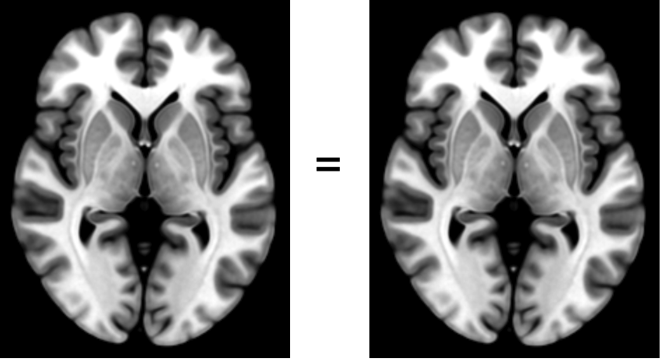
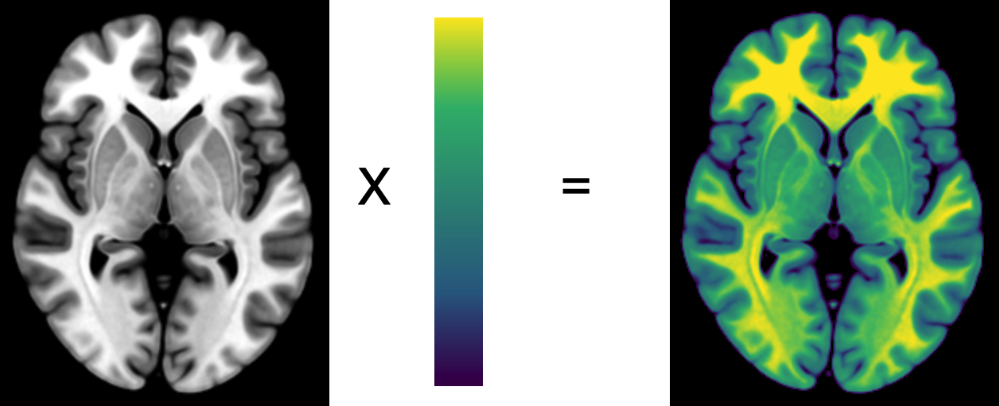
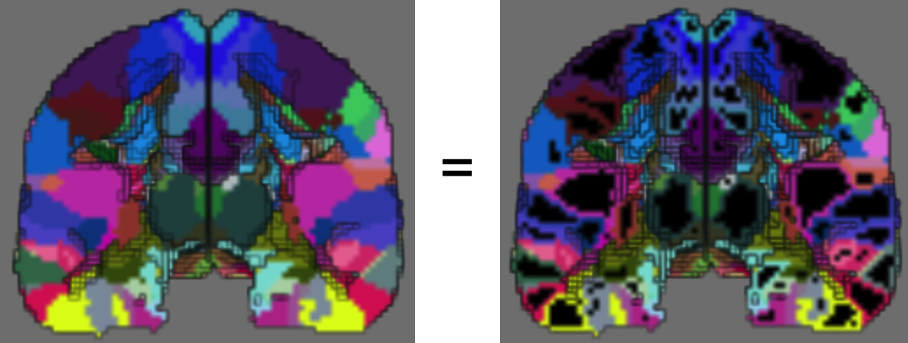
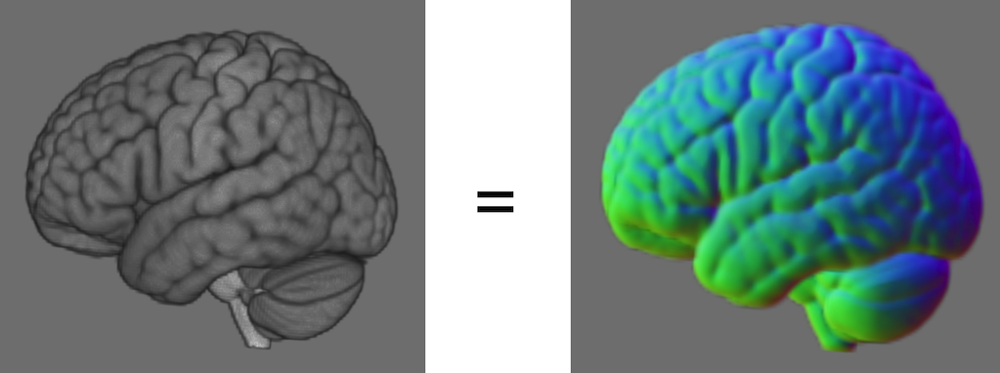

# WebGL Compute Shader Demo

This is a kludge for demonstrating WebGL compute shaders for 3D textures. Unless you wish to learn about compute shaders, you should evaluate the original [WebGL volume rendering project](https://github.com/rordenlab/rordenlab.github.io)

## Compute Shaders

The **clone** shader duplicates the input image. This is useful in combination with other compute shaders: since we must read and write to different textures, it is useful to generate a temporary copy when processing an image. In practice, the [copyTexSubImage3D](https://developer.mozilla.org/en-US/docs/Web/API/WebGL2RenderingContext/copyTexSubImage3D) function is a better way to achieve this effect, but we use it here to illustrate the most basic `pass through` compute shader.



Raw MRI and CT scans generate an one intensity value per pixel. The **Scalar2RGBA** function converts this grayscale brightness using a color lookup table, generating independent values for red, green, blue and alpha (transparency).



The **Edge** filter will blacken any voxel that has the same color as its six neighbors. This is useful for anatomical atlases, where we want to emphasize the boundaries.




The **Sobel** filter estimates the image intensity [gradients](https://github.com/neurolabusc/blog/tree/main/GL-gradients) which are used to emulate lighting. This is actually two compute shaders: an initial filter blurs the data a little bit, and the second computes the [Sobel operator](https://en.wikipedia.org/wiki/Sobel_operator).



## Benefits and Limitations

JavaScript is relatively slow and tends to use a single central processor (CPU) at a time. A WebGL shader taps the native of thousands of cores in a graphics processor (GPU). Further, GPUs have hardware instructions for 3D interpolation and easing functions that provide outstanding performance for some tasks. 

However, there are some severe limitations which mean that WebGL compute shaders are only appropriate for some applications:

 - Transferring memory to and from the GPU is slow, so compute shaders are most useful for data that will be used for graphic visualization.
 - A single GPU cores is not as capable as a CPU core, and one needs to minimize  [use of conditionals](http://theorangeduck.com/page/avoiding-shader-conditionals).
 - GPU-compute specific languages like CUDA and OpenCL are not available from JavaScript, limiting us to WebGL which was really designed for graphics. We do not have access to 64-bit precision and each shader only outputs data to a 2D bitmap (e.g. a screen). Therefore, to process a 3D volume we must sequentially apply 2D shaders to each and every slice.

## Installation

You need to have a web server. You can adjust the settings for any Github page to be served as a web page, allowing you to share your latest commits.

For development, you can serve the files locally using [http-server](https://www.npmjs.com/package/http-server).

```
> http-server
Starting up http-server, serving ./
Available on:
  http://127.0.0.1:8080
  http://192.168.0.220:8080
Hit CTRL-C to stop the server
```

## Links

 - [WebGL 2 / GLSL 300 ES](https://www.khronos.org/files/webgl20-reference-guide.pdf) reference guide (note WebGL 1 uses GLSL 100 ES). 
 - [WebGL2 Fundamentals](https://webgl2fundamentals.org) provides outstanding tutorials.
 - Graphical WebGL  examples (many WebGL 1) include [shadertoy](https://www.shadertoy.com), [glslsandbox](https://glslsandbox.com), [webgl-shaders](https://webgl-shaders.com), [webglsamples](https://webglsamples.org).
